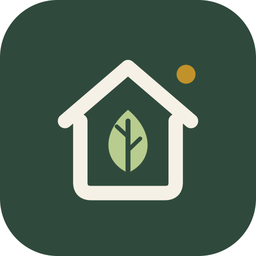
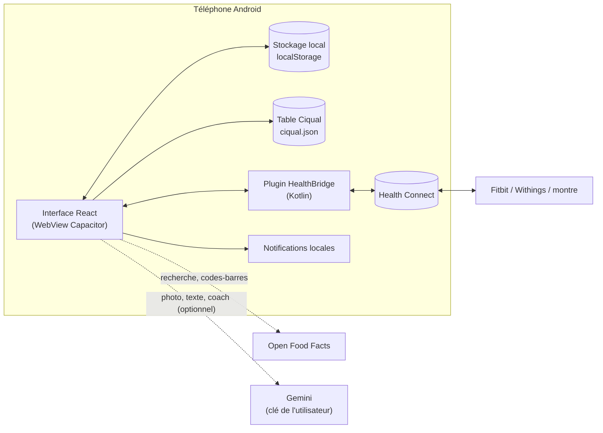

<p align="center">
  
</p>

<h1 align="center">NutriMaison</h1>

<p align="center">
  Suivi nutritionnel, poids et sport pour Android — en français, gratuit, sans compte et sans serveur.
</p>

<p align="center">
  <a href="LICENSE"></a>
  
  
</p>

> 📦 **Pas envie de compiler ?** L'APK prêt à installer est disponible dans les **[Releases](../../releases/latest)** : télécharge `nutrimaison-vX.Y.Z.apk` et installe-le directement sur ton téléphone ([voir comment](#installer-lapk-prêt-à-lemploi)).

---

## Sommaire

- [Pourquoi NutriMaison](#pourquoi-nutrimaison)
- [Fonctionnalités](#fonctionnalités)
- [Comment ça marche](#comment-ça-marche)
- [Installer l'APK prêt à l'emploi](#installer-lapk-prêt-à-lemploi)
- [Compiler depuis les sources](#compiler-depuis-les-sources)
- [Configuration dans l'app](#configuration-dans-lapp)
- [Structure du projet](#structure-du-projet)
- [Publier une version (APK)](#publier-une-version-apk)
- [Développement](#développement)
- [Dépannage](#dépannage)
- [Confidentialité](#confidentialité)
- [Sources des données et licences](#sources-des-données-et-licences)
- [Licence et contributions](#licence-et-contributions)

---

## Pourquoi NutriMaison

Une alternative libre aux applis de suivi payantes : toutes les fonctions sont disponibles sans abonnement, et **toutes les données restent sur le téléphone**.

L'idée centrale : les formules de calcul des besoins (Mifflin-St Jeor, niveau d'activité…) se trompent souvent de plusieurs centaines de calories. NutriMaison compare **ce que tu notes** à **l'évolution réelle de ton poids** pour calculer ton **besoin réel**, et ajuste ton objectif en conséquence.

## Fonctionnalités

### Nutrition
- **Journal par repas** (petit-déjeuner, déjeuner, dîner, collations) : un bloc par repas avec ses totaux, repliable.
- **Base Ciqual intégrée** : 3 341 aliments génériques officiels (Anses), disponibles hors ligne, recherche sans accents et mot à mot.
- **Produits de marque** via Open Food Facts (recherche en ligne) et **scanner de codes-barres** (détecteur natif Android, ZXing en secours, lampe, photo, saisie manuelle des chiffres). Produit inconnu : ajout en un formulaire (étiquette lue par l'IA en option), retrouvé au scan suivant.
- **Photo d'un repas** analysée par IA (Gemini, optionnel) ou détection locale (TensorFlow.js).
- **Texte IA** : « 2 tortillas, 150 g de poulet, du cheddar » → aliments, quantités et valeurs estimés, modifiables avant ajout. Mode recette avec portions.
- **Favoris, récents, repas types** et **« Comme la veille »** pour noter en quelques secondes ; copie d'un repas entier ou de quelques aliments depuis/vers un autre jour.
- **Valeurs modifiables à la volée** quand ton produit diffère de celui de la base (option : le mémoriser).
- **Modification** de chaque aliment noté : quantité, repas, jour ; « j'en ai mangé ½ » (ou ¼, ⅔…) sur un aliment ou un repas entier.
- **Recettes** : 36 recettes intégrées, recettes perso, recherche par ingrédients, import TheMealDB.
- **Mon frigo** : ce que tu as sous la main → recettes faisables, ce qu'il manque, idées de plats par l'IA, **liste de courses** partageable.
- **Hydratation** : choix de la quantité (verre, canette, bouteille… ou libre), bouton rapide qui retient la dernière quantité, eau bue + eau contenue dans les aliments (valeurs Ciqual).

### Corps et progrès
- **Pesées** avec courbe de **tendance lissée** (la pesée du jour varie de 1 à 2 kg, la tendance non).
- **Masse grasse** : méthodes **US Navy** et **Armée US 2023**, masse maigre, métabolisme Katch-McArdle.
- **Besoin réel** : calculé sur 4 semaines à partir des repas notés et de l'évolution du poids, avec proposition d'un nouvel objectif.
- **Bilan de la semaine** : calories jour par jour, moyennes, protéines, tendance du poids, sport, projection.

### Sport
- 142 exercices, 20 programmes (maison, haltères, élastiques, kettlebell, salle, boxe, mobilité, course, vélo…).
- **Séances guidées** : chrono, temps de repos, bips et vibrations, écran maintenu allumé.
- **Progression par niveaux** (ex. pompes : mur → plan de travail → chaise → genoux → classiques…) avec montée de niveau proposée.
- **Séance sur mesure** hors ligne selon le temps disponible, l'objectif et le matériel.
- **Coach IA** (Gemini) : « 30 min de boxe sans sauts » → séance complète.
- Minuteur de rounds de boxe, 54 activités libres, historique et records.
- Calories **nettes** (au-delà du repos), calculées d'après le poids. Pas journaliers intégrés au besoin sans double comptage.

### Intégrations
- **Health Connect** (Fitbit, Withings, Pixel Watch…) : envoi des repas, de l'hydratation, des séances, des pesées et de la masse grasse ; lecture des pas, du poids, des calories mesurées et des séances. **Sans doublon** (voir plus bas).
- **Rappels** : le soir si rien n'est noté, le matin si la pesée n'est pas faite.
- **Sauvegarde / restauration** de toutes les données (export texte).

## Comment ça marche

### Architecture



- L'interface est une app **React** (Vite) empaquetée en APK par **Capacitor 6**.
- Toutes les données sont dans le **stockage local** de l'app (`localStorage`). Il n'y a **aucun serveur NutriMaison**.
- Les seuls appels réseau sont Open Food Facts (produits de marque), TheMealDB (recettes en ligne) et Gemini (uniquement si une clé est renseignée).
- Health Connect passe par un **petit plugin Kotlin maison** (`native/android/HealthBridgePlugin.kt`) qui utilise la bibliothèque officielle `androidx.health.connect:connect-client`.

### Calcul des besoins

| Étape | Méthode |
|---|---|
| Métabolisme de base | Mifflin-St Jeor, ou Katch-McArdle si la masse grasse est connue |
| Mode « détaillé » | base × 1,2 + pas au-delà de 3 500/jour + sport prévu au programme |
| Mode « simple » | base × niveau d'activité |
| Objectif perte | maintien − 20 % (500 kcal max), avec un plancher de sécurité |
| Protéines | 2,2 g/kg de masse maigre, ou 1,8 g/kg d'un poids de référence plafonné |
| Calories du sport | nettes : (MET − 1) × poids × durée |
| Pas | 0,5 kcal/kg/km, longueur de pas ≈ 0,415 × taille |

### Besoin réel (adaptatif)

```
besoin réel = apport moyen noté − (pente du poids en kg/jour × 7 700)
```

- Fenêtre de 28 jours, au moins **6 pesées** sur **14 jours ou plus**, et des repas notés au moins **6 jours sur 10**.
- La pente est calculée par moindres carrés sur les pesées, pas sur deux points isolés.
- Ce calcul corrige automatiquement les petits oublis réguliers de saisie (huile, sauces, boissons).

### Health Connect sans doublon

Chaque donnée n'a **qu'une seule source** :

| Donnée | Source | NutriMaison |
|---|---|---|
| Repas, macros | NutriMaison | **écrit** |
| Hydratation (eau bue) | NutriMaison | **écrit** |
| Séances faites dans l'app | NutriMaison | **écrit** (type, durée) |
| Calories de ces séances | montre | non écrit par défaut |
| Pesées tapées à la main | NutriMaison | **écrit** |
| Pesées de la balance | Withings | **lit** (jamais renvoyé) |
| Pas | montre / téléphone | **lit** (total dédoublonné par Health Connect) |
| Calories mesurées, séances externes | montre | **lit** (affichage) |

Mécanismes :
- chaque enregistrement envoyé porte un **`clientRecordId` stable** (`nm_food_<id>`, `nm_weight_<date>`…) : une modification **remplace** l'ancien au lieu d'en créer un nouveau ;
- une suppression ou un déplacement dans l'app est **répercuté** dans Health Connect ;
- les données lues **excluent** celles écrites par NutriMaison ;
- une saisie manuelle (pas, poids) **prend la priorité** sur l'import pour ce jour-là.

Synchronisation : à l'ouverture de l'app, au retour dans l'app (après une minute), et 4 secondes après chaque modification. Android ne permet pas la lecture en arrière-plan sans autorisation spéciale.

## Installer l'APK prêt à l'emploi

La façon la plus simple, sans rien installer sur un ordinateur.

1. Sur le téléphone, ouvre la page **[Releases](../../releases/latest)** et télécharge le fichier `nutrimaison-vX.Y.Z.apk` de la dernière version.
2. Ouvre le fichier téléchargé. Android demande d'autoriser l'installation depuis ton navigateur ou ton gestionnaire de fichiers : accepte pour cette source.
3. **Play Protect** affiche un avertissement, car l'app ne vient pas du Play Store : touche **Plus de détails → Installer quand même**. C'est normal pour toute appli installée hors Play Store.
4. Ouvre NutriMaison, puis va dans **Profil** pour renseigner ton profil (et, si tu veux, ta clé Gemini gratuite pour les fonctions IA).

**Configuration requise** : Android 8.0 ou plus. Health Connect nécessite Android 9 ou plus (intégré d'office à partir d'Android 14).

**Mettre à jour** : télécharge la nouvelle version et installe-la par-dessus l'ancienne, tes données sont conservées. Par précaution, fais d'abord **Profil → Sauvegarde → Exporter**.

> ⚠️ Une mise à jour ne s'installe par-dessus que si elle est signée avec la **même clé**. Si tu passes de l'APK des Releases à une version que tu as compilée toi-même (ou l'inverse), Android refusera : exporte tes données, désinstalle, installe la nouvelle version, puis restaure (**Profil → Sauvegarde → Restaurer**).

## Compiler depuis les sources

### Prérequis

- [Node.js](https://nodejs.org) 18 ou plus
- [Android Studio](https://developer.android.com/studio) avec le **SDK Android 36** (Tools → SDK Manager)
- **JDK 17** (celui d'Android Studio convient)

### Première installation

```bash
git clone <url-du-depot> nutrimaison
cd nutrimaison
setup.bat          # Windows
./setup.sh         # macOS / Linux
```

`setup` enchaîne :
1. `npm install`
2. `npm run build` (app web dans `dist/`)
3. `npx cap add android` (si le dossier `android/` n'existe pas)
4. `node scripts/patch-android.mjs` (voir ci-dessous)
5. `npx cap sync`

Puis :

```bash
npx cap open android
```

Dans Android Studio : laisser la synchro Gradle se terminer (choisir **JVM 17** si demandé), puis **Build → Generate App Bundles or APKs → Build APK(s)**.

L'APK est dans `android/app/build/outputs/apk/debug/app-debug.apk`.

### Le script `patch-android.mjs`

Le dossier `android/` est **généré** (il n'est pas versionné). Le script applique toutes les adaptations nécessaires, et peut être relancé sans risque :

- copie le plugin Kotlin Health Connect et la page de confidentialité exigée par Android ;
- enregistre le plugin dans `MainActivity` ;
- passe à **Android Gradle Plugin 8.9.1**, **Gradle 8.11.1**, **Kotlin 2.1.21**, **compileSdk 36**, **minSdk 26** (exigés par Health Connect 1.1.0) ;
- ajoute la bibliothèque Health Connect et les coroutines Kotlin ;
- complète le manifeste : caméra, notifications, permissions Health Connect, `<queries>` ;
- installe le **logo** (icônes adaptatives, monochrome, écran de démarrage, icône de notification) ;
- reporte la **version** de `package.json` dans l'APK ;
- vérifie que le dossier `android/` correspond à l'identifiant de l'app (`appId` de `capacitor.config.json`, actuellement `app.nutrimaison`).

### Mettre à jour l'app sans perdre les données

```bash
git pull
npm install
npm run build
node scripts/patch-android.mjs
npx cap sync
```

Recompiler **sur le même PC** (même clé de signature debug) et installer par-dessus l'ancienne version. Par sécurité : **Profil → Sauvegarde → Exporter** avant.

Pour installer sans l'avertissement Play Protect, passer par ADB :

```bash
adb install -r android/app/build/outputs/apk/debug/app-debug.apk
```

## Configuration dans l'app

| Où | Quoi |
|---|---|
| **Profil → Calculer mes besoins** | Sexe, âge, taille, poids, mode détaillé (pas + sport) ou simple, objectif |
| **Profil → Détection photo par IA** | Clé Gemini gratuite ([aistudio.google.com](https://aistudio.google.com)), bouton « Tester la clé ». Le modèle est choisi automatiquement, avec bascule si un modèle est saturé ou retiré. |
| **Profil → Rappels** | Heure du rappel du soir et de la pesée |
| **Profil → Health Connect** | Activer, choisir ce qui est envoyé et lu, « Autoriser l'accès » |
| **Profil → Calories du sport** | Remanger les calories du sport : non (conseillé), la moitié, la totalité |
| **Sport → Personnaliser** | Matériel, niveau par mouvement, séances par semaine, mode sans sauts, pas habituels |
| **Corps → Masse grasse** | Mensurations, méthode Navy ou Armée |

## Structure du projet

```
nutrimaison/
├── src/
│   ├── main.jsx               Point d'entrée React
│   ├── App.jsx                Écrans principaux : accueil, ajout, recettes, profil
│   ├── shared.jsx             Stockage, dates, calculs d'énergie, composants communs
│   ├── ciqual.json            Table Ciqual compactée (généré, voir scripts/)
│   ├── ciqualDb.js            Chargement à la demande et recherche Ciqual
│   ├── scanner.js             Scanner de codes-barres et caméra
│   ├── gemini.js              Appels Gemini : choix du modèle, nouvel essai, bascule
│   ├── AiMeal.jsx             Onglet « Texte IA » et estimation d'un aliment
│   ├── MealTools.jsx          Copie de repas, repas types, produit inconnu au scan
│   ├── Fridge.jsx             Mon frigo, idées de plats IA, liste de courses
│   ├── Weight.jsx             Poids, tendance, masse grasse, besoin réel
│   ├── Bilan.jsx              Bilan de la semaine
│   ├── Sport.jsx              Onglet Sport : programmes, séance guidée, historique
│   ├── SportGen.jsx           Séance sur mesure et coach IA
│   ├── sportData.js           Exercices, programmes, activités (valeurs MET)
│   ├── healthconnect.js       Synchronisation Health Connect (logique anti-doublon)
│   ├── HealthConnectCard.jsx  Réglages Health Connect
│   └── reminders.js           Rappels (notifications locales)
├── native/
│   ├── android/               Plugin Kotlin + ressources Android (icônes, splash)
│   └── brand/                 Logo source (SVG)
├── scripts/
│   ├── patch-android.mjs      Prépare le projet Android généré
│   └── ciqual-to-json.py      Convertit l'Excel Ciqual en src/ciqual.json
├── public/                    Favicon
├── setup.bat / setup.sh       Installation en une commande
├── capacitor.config.json
└── vite.config.js
```

### Données stockées (localStorage)

| Clé | Contenu |
|---|---|
| `day:AAAA-MM-JJ` | Repas, eau, pas et données Health Connect du jour |
| `goals`, `personalInfo` | Objectifs et profil (dont la clé Gemini) |
| `weights`, `weightSources`, `measures` | Pesées, origine de chaque pesée, mensurations |
| `workouts`, `sportSettings` | Séances faites, réglages et programmes perso |
| `customFoods`, `customRecipes`, `favorites`, `mealTemplates` | Aliments, recettes, favoris et repas types perso |
| `pantry`, `fridgeExtras`, `shoppingList` | Contenu du frigo et liste de courses |
| `healthConnect`, `reminders`, `geminiModel` | Réglages et état des intégrations |

## Publier une version (APK)

Pour le mainteneur du dépôt :

1. Mettre à jour `version` dans `package.json` et le `CHANGELOG.md`. Le script `patch-android.mjs` reporte cette version dans l'APK (`versionName`, et `versionCode` = 2.8.0 → 20800, qui doit toujours augmenter).
2. Compiler :
   ```bash
   npm run build
   node scripts/patch-android.mjs
   npx cap sync
   cd android
   gradlew.bat assembleDebug        # ./gradlew assembleDebug sous macOS / Linux
   ```
3. Renommer `android/app/build/outputs/apk/debug/app-debug.apk` en `nutrimaison-vX.Y.Z.apk`.
4. Créer une **Release** avec le tag `vX.Y.Z`, y joindre l'APK et coller la partie du CHANGELOG correspondante.

**Toujours compiler avec la même clé de signature.** Sinon les utilisateurs ne pourront pas mettre à jour sans désinstaller. La clé debug est dans `~/.android/debug.keystore` (Windows : `C:\Users\<toi>\.android\debug.keystore`) : sauvegarde-la. Elle n'est **jamais** à mettre dans le dépôt.

## Développement

```bash
npm install
npm run dev        # http://localhost:5173, accessible aussi depuis le téléphone sur le même réseau
```

Dans le navigateur, tout fonctionne sauf Health Connect, les rappels et le détecteur de codes-barres natif (ZXing prend le relais). Ces fonctions ne se testent que dans l'APK.

### Mettre à jour la table Ciqual

1. Télécharger le fichier Excel sur [ciqual.anses.fr](https://ciqual.anses.fr).
2. Lancer :
   ```bash
   pip install openpyxl
   python scripts/ciqual-to-json.py Table_Ciqual_XXXX.xlsx src/ciqual.json
   ```
3. Mettre à jour l'année dans `CIQUAL_CITATION` (`src/ciqualDb.js`).

### Modifier le logo

Éditer `native/brand/motif.svg` (le dessin) et `native/brand/icon.svg` (l'icône complète), puis régénérer les PNG de `native/android/res/`.

## Dépannage

| Problème | Solution |
|---|---|
| `npx cap ...` : *could not determine executable to run* | Pas dans le bon dossier, ou `npm install` pas fait. |
| Menu « Build APK » grisé | Synchro Gradle pas terminée ou en échec : File → Sync Project with Gradle Files, voir l'onglet Build. |
| *Gradle 8.x is incompatible with JVM 25* | Relancer `node scripts/patch-android.mjs` (il fixe le JDK d'Android Studio), ou choisir **jbr-21 / JDK 17** : Settings → Build Tools → Gradle → Gradle JDK. Autre emplacement du JDK : variable d'environnement `NUTRIMAISON_JDK`. |
| *connect-client requires compileSdk 36 / AGP 8.9.1* | Relancer `node scripts/patch-android.mjs`, installer le SDK 36. |
| Avertissement Play Protect à l'installation | Normal hors Play Store : « Installer quand même », ou installer via ADB. |
| Clé Gemini « incorrecte » | Profil → Tester la clé : le message indique la vraie cause (clé, quota, saturation). |
| « Modèle saturé » ou « délai dépassé » | Temporaire côté Google : l'app réessaie et change de modèle (40 s max par modèle). Réessayer plus tard. |
| Scanner qui ne lit rien | Rapprocher le code (10-15 cm), lampe, ou bouton « Prendre le code-barres en photo ». |
| *Le dossier android/ a été créé pour « … »* | L'identifiant de l'app a changé : supprimer le dossier `android` et relancer `setup`. |
| Android affiche « version 1.0 » | Relancer `node scripts/patch-android.mjs` puis recompiler. |
| Ancienne icône toujours affichée | Cache du lanceur : redémarrer le téléphone, ou désinstaller/réinstaller (après export). |

## Confidentialité

- Pas de compte, pas de serveur, pas de statistiques d'usage.
- La clé Gemini reste sur le téléphone. Avec une clé, les photos et textes analysés sont envoyés à Google pour l'analyse, et rien d'autre.
- Health Connect : les données restent sur l'appareil, et l'accès se retire à tout moment dans les paramètres Android.

## Sources des données et licences

| Données | Source | Licence |
|---|---|---|
| Aliments de base | Anses. 2025. Table de composition nutritionnelle des aliments Ciqual. | [Licence Ouverte Etalab](https://www.etalab.gouv.fr/licence-ouverte-open-licence/) |
| Produits de marque, codes-barres | [Open Food Facts](https://world.openfoodfacts.org) | ODbL |
| Recettes en ligne | [TheMealDB](https://www.themealdb.com) | API publique |
| Intensité des activités (MET) | Compendium of Physical Activities | valeurs publiées |


## Licence et contributions

Le code de NutriMaison est un **logiciel libre** sous licence **[GNU GPL v3](LICENSE)** (`GPL-3.0-only`).

En résumé (seul le texte de la [licence](LICENSE) fait foi) :
- tu peux **utiliser, étudier, modifier et redistribuer** l'app, y compris contre rémunération ;
- toute version modifiée et redistribuée doit rester sous **GPL v3**, avec son **code source** disponible et la mention des auteurs ;
- l'app est fournie **sans aucune garantie**.

**Contributions** : les propositions sont bienvenues (issues, pull requests). En proposant une contribution, tu acceptes qu'elle soit publiée sous GPL v3 **et** que l'auteur du projet puisse aussi la distribuer sous d'autres conditions (par exemple une version publiée sur un store). Si ça ne te convient pas, signale-le dans ta pull request.

**Nom et logo** : le nom « NutriMaison » et son logo ne sont pas couverts par la licence du code. Une version modifiée redistribuée doit porter un autre nom et un autre logo.

Les bibliothèques utilisées (React, Capacitor, ZXing, TensorFlow.js, lucide…) sont sous licences MIT ou Apache 2.0, compatibles avec la GPL v3. Les données gardent leur propre licence (voir le tableau ci-dessus).

> NutriMaison donne des **estimations** et ne remplace pas un avis médical ou diététique.
